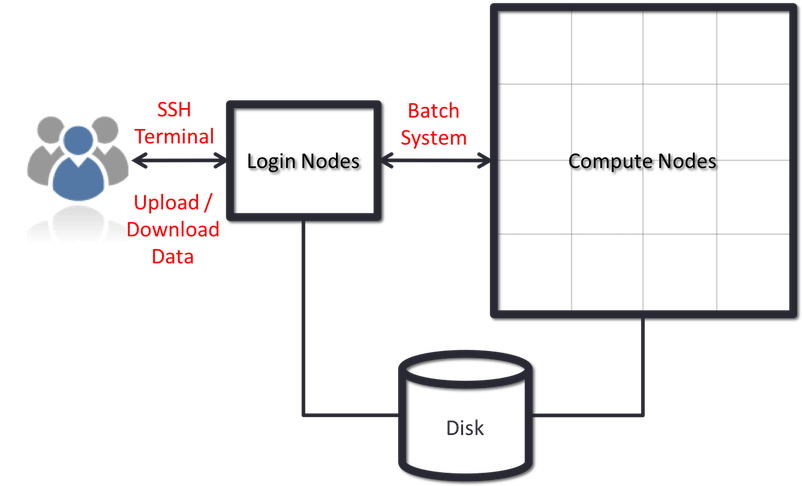

# What is a cluster anyway?

## Cluster components

Clusters and clouds are very similar. The cloud is mostly Linux,
whereas the Flux cluster is all Linux servers. The cluster has
nodes (servers) that perform different functions.

The following diagram shows a generic cluster configuration.

We call specific physical machines _nodes_, and there are three types of
which you should be aware:  login, data transfer, and compute.

As you can see from the diagram of the cluster, your point of contact is a
_login node_ of some type.  Flux has two types, one for interactive commands
and one only for data transfer commands.

Login nodes have policies regarding their use. On Flux the policy says these
are the intended uses:  edit files, compile source code, and run test
programs on small data sets for short periods of time to uncover syntax
errors and the like. A login node is not where you should run something
like `recon-all`, which can take a day, but it is OK to run something
small, like `bet`, which will finish in a minute or two.

When you want to get some real work done, you use the data transfer node to
copy data to Flux; then you use a login node to create a file containing the
commands for the programs you wish to run with that data.  You then submit
the file of commands to be processed _in batch_.  The cluster then runs your
commands on a _compute node_.  When all the processing is done, you use the
data transfer node to copy the results from the cluster.

## CPUs and memory

A node with one physical CPU would look something like this.

had only one physical CPU processor. Most Flux nodes have two of those.

## Disk storage

There is network storage space that is shared among the login (including data transfer) and compute nodes, so files you see from a login node are also visible from compute nodes.

Typically each user will get a small amount of space for configuration
files, dot files, maybe enough space to install some software, always
with a quota.  There will also be a large, temporary, fast file system
for user data to be stored and processed from.

