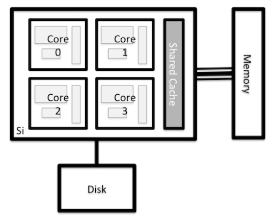

# Introduction to HPC at UM for SC2

The purpose of this presentation is to provide a quick overview of what
HPC and HTC is, system components, and how to find software to run.  We
will use two Python scripts from a prior SC2 workshop to illustrate.

## Cluster components

The cluster is made up of nodes that perform various functions; the
following diagram shows a generic cluster configuration.

As you can see, the point of contact is a login node of some type.  Flux
has two types, one for interactive commands and one only for data
transfer commands.

Login nodes almost always have policies.  Ours is they are to edit
files, compile source code, and run test programs on small data
sets for short periods of time to uncover syntax errors and the like.

The login nodes are not to be used for large parallel programs,
large datasets, or for a long time. We have compute nodes for that.
We will show you how to get a compute node(s) if you must have one
to test things in something called an interactive batch job.
(Oxymoron alert!)

## Nodes

We call specific physical machines _nodes_, and there are three types of
which you should be aware:  login, data transfer, and compute.

Nodes typically look something like this,

only most of our nodes have at least eight cores per CPU and most nodes
have two CPU sockets.

## Disk storage

There is storage space that is shared among the login (including data
transfer) and compute nodes, so files you see from a login node are
also visible from compute nodes.

Typically each user will get a small amount of space for configuration
files, dot files, maybe enough space to install some software, always
with a quota.  There will also be a large, temporary, fast file system
for user data to be stored and processed from.

## Scaling

People who run HPC will use the word _scaling_, and they almost always
mean &lsquo;monotonically increasing&rsquo;. Therefore most _scaling_
problems are meant, implicitly, to mean &lsquo;Will it get bigger
gracefully?&rsquo;  I suggest that you remember that for many problems
and researchers, _scaling_ may mean &lsquo;Will it get smaller
gracefully?&rsquo;

If some software is designed to run on 100 computers with a huge, fast
filesystem and process thousands of jobs, will it scale &ndash; in terms of
time and expertise needed to install, configure, and maintain $ndash; down
to one computer, local disk, and a reluctant system administrator?
